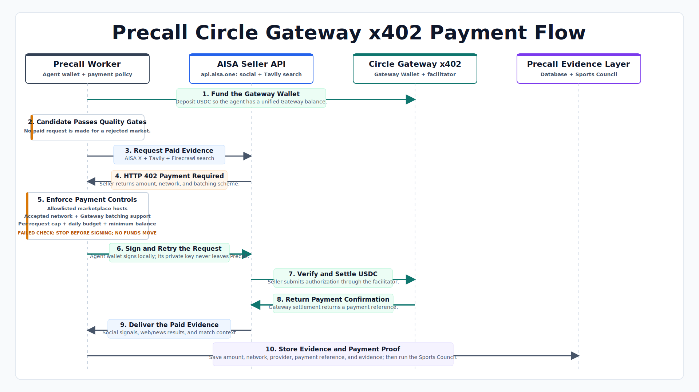

# Precall Circle Gateway x402 Payment Flow

1. **Fund Gateway:** The Precall agent wallet deposits USDC into the Circle Gateway Wallet.
2. **Approve a Candidate:** Paid evidence is requested only after a soccer market passes Precall's quality gates.
3. **Request Evidence:** The worker calls `api.aisa.one` for AISA X/social signals and Tavily web/news search.
4. **Receive HTTP 402:** The seller returns its USDC amount, supported network, and Circle Gateway batching requirement.
5. **Apply Controls:** Precall validates the seller host, payment network, batching scheme, request cap, daily budget, and Gateway balance. A failed check stops before signing, so no funds move.
6. **Sign and Retry:** The server-only agent wallet signs the x402 payment authorization locally without exposing its private key, and the wrapped request retries automatically.
7. **Settle USDC:** The seller's x402 middleware uses the Circle facilitator to verify the authorization and settle from the Gateway balance.
8. **Receive Confirmation:** Circle Gateway returns the payment reference after settlement.
9. **Receive Evidence:** AISA returns paid social signals and Tavily web/news evidence to Precall.
10. **Record and Analyze:** Precall stores the provider, amount, network, payment reference, transaction reference, and evidence before the Sports Council analyzes it.
