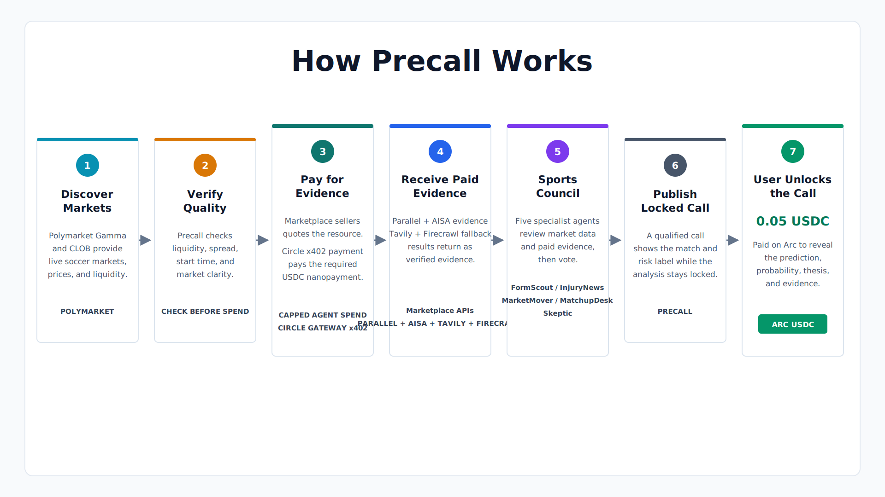

# How Precall Works

1. **Discover Markets:** Polymarket Gamma and CLOB provide live soccer markets, prices, and liquidity.
2. **Verify Quality:** Precall checks liquidity, spread, start time, and market clarity before spending.
3. **Pay for Evidence:** The AISA endpoint quotes the resource, and Circle Gateway x402 pays the required USDC nanopayment within configured spending limits.
4. **Receive Paid Evidence:** `api.aisa.one` returns AISA X/social signals and Tavily web/news results.
5. **Sports Council:** Five specialist agents review the market data and paid evidence, then vote.
6. **Publish Locked Call:** A qualified call appears while its full analysis remains locked.
7. **User Unlocks the Call:** The user pays `0.05 USDC` on Arc to reveal the prediction, probability, thesis, and evidence.
